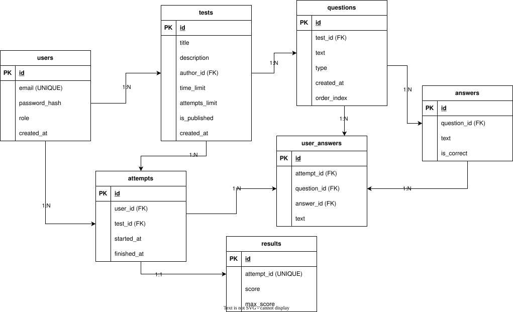

# Database Design

## ER-Diagram description
В базе данных используются следующие основные сущности:
* users — хранение пользователей системы;
* tests — тесты, создаваемые преподавателями;
* questions — вопросы тестов;
* answers — варианты ответов (включая текстовые правильные ответы);
* attempts — попытки прохождения теста;
* user_answers — ответы пользователей;
* results — результаты тестирования.

Особенности
* Поддержка различных типов вопросов (single, multiple, text);
* Автоматическая проверка текстовых ответов;
* Ограничение количества попыток;
* Хранение истории прохождений.